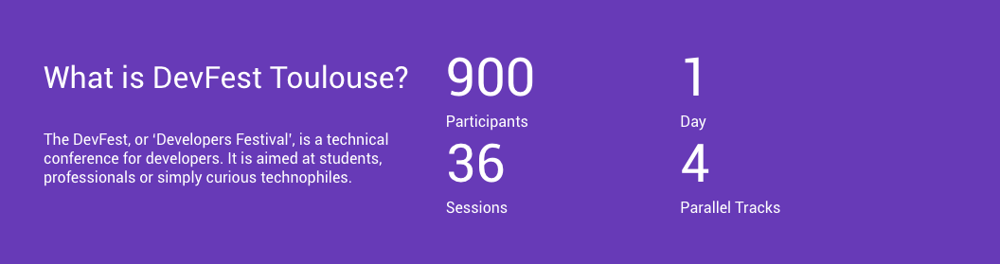
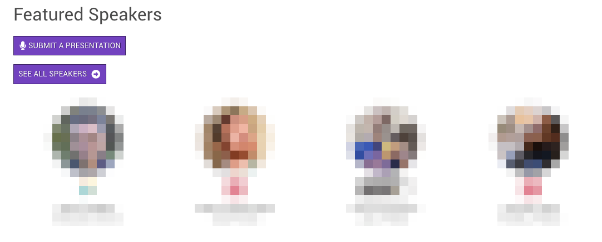
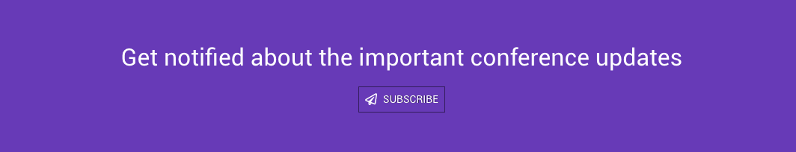
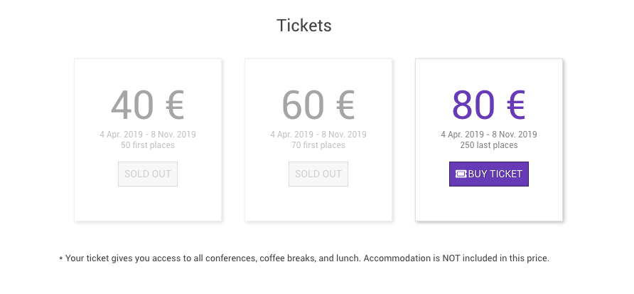
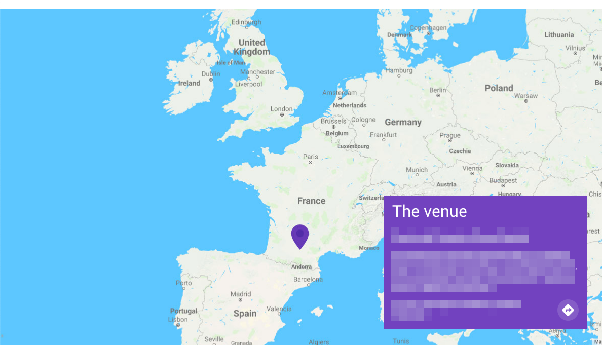
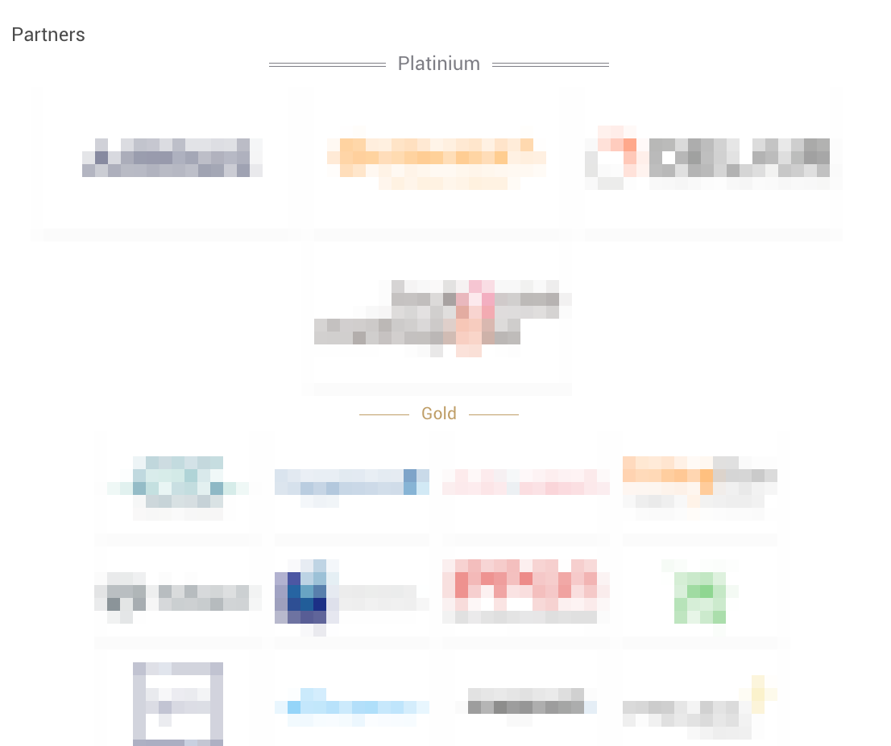
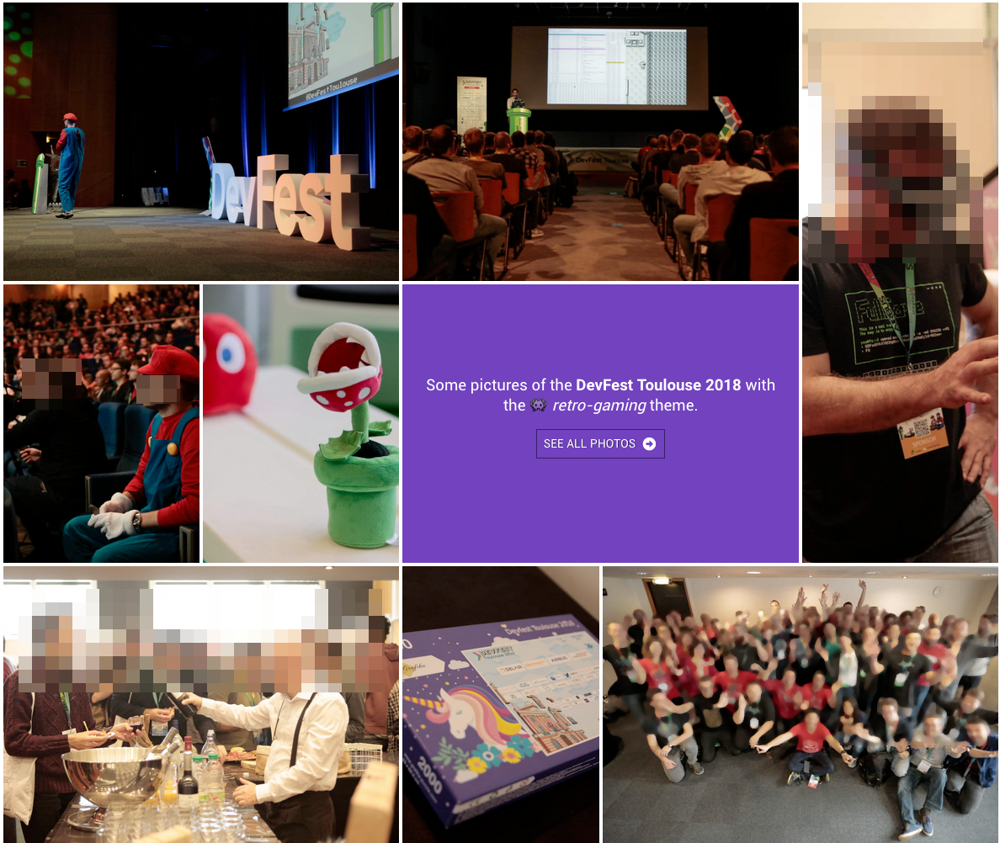

# DevFest Theme Hugo

DevFest Theme Hugo is a theme for conferences/events.

It's developed for the 2019 version of Devfest Toulouse.

See a real usage here: <https://2019.devfesttoulouse.fr/>

## Building my conference site from scratch

1. Install [Hugo](https://gohugo.io)
2. Create a new site by running:

```bash
hugo new site my-conf
cd my-conf
mkdir themes
git submodule add https://github.com/GDGToulouse/devfest-theme-hugo.git themes/devfest-theme-hugo
```

3. Then edit your `config.toml` file with

```toml
# ...
theme = "devfest-theme-hugo"
# ...
```


4. It's done. Just start Hugo server to see it live!

```bash
hugo server
```

## Customizing the site

`yarn` to install the dependency

Run `npm start` to watch Sass changes.

When you are happy with the result run `npm run build` to build the minified version

### Site params


```toml
#...


enableEmoji = true
enableRobotsTXT = true
enableMissingTranslationPlaceholders = true

googleAnalytics = "UA-XXXXXXXX-X"

[params]
    title = "DevFest Toulouse 2019"
    date = "2019-10-03"
    description = "The DevFest, or 'Developers Festival', is a technical conference for developers. It is aimed at students, professionals or simply curious technophiles."
    images = ["/images/social-share.jpg"]
    email = "contact@devfesttoulouse.fr"
    keywords = "event, gdg, gde, devfest, google, programming, android, chrome, developers, web, cloud, androiddev"
    copyright = "We :heart:️ chocolatines"
    cfpUrl = "https://conference-hall.io/public/event/HJRThubF4uYPkb7jSUxi"
    subscriptionUrl = "http://eepurl.com/dps1j5"
    appleTouchIcon = "/apple-touch-icon.png"
    favicon32 = "/favicon-32x32.png"
    favicon16 = "/favicon-16x16.png"
    manifest = "/manifest.json"
    safariPinnedTab = "/safari-pinned-tab.svg"
    themeColor = "#673ab7"

[params.logos]
    jumbo = "/images/logos/devfest_color_text.png"
    header = "/images/logos/devfest_color_text.png"
    footer = "/images/logos/devfest_gray_text.png"

#[menu]
#[[menu.main]]
#    identifier = "jobs"
#    name = "Jobs"
#    url = "https://jobs.devfesttoulouse.fr/"
#    weight = 200
#    external = true

[languages]
[languages.en]
    weight = 1
    languageName = "gb"

[languages.fr]
    weight = 2
    languageName = "fr"

[languages.fr.params]
    description = "Le DevFest, ou 'Developers Festival', est une conférence technique destinée aux développeurs. Elle s'adresse aussi bien aux étudiants, aux professionnels ou tout simplement aux curieux technophiles."

[taxonomies]
  tag = "tags"
#...
```

### Header

The top navigation bar is build with

* Site title
* Site parameter `logos.header` for the logo
* Site languages if you need a multilingual site
* Menu `main`

### Footer

The footer is build with

* Site title
* Site params `email`, `subscriptionUrl`, `logos.footer`, `copyright`
* data from `data/footer.yml`


```yml
share:
  - name: facebook
    url: https://www.facebook.com/sharer.php?u=
  - name: twitter
    url: https://twitter.com/intent/tweet?text=

follow:
  - name: facebook
    url: https://www.facebook.com/GDGToulouse/
  - name: twitter
    url: https://twitter.com/devfesttoulouse
  - name: linkedin
    url: https://www.linkedin.com/company/devfesttoulouse/
  - name: youtube
    url: https://www.youtube.com/channel/UCx83f-KzDd3o1QK2AdJIftg

content:
  - title: footer_about
    links:
      - name: GDG Toulouse
        url: http://gdgtoulouse.fr/
        newTab: true
      - name: Google Developers Group
        url: https://developers.google.com/
        newTab: true
      - nameKey: footer_coc
        url: /code-of-conduct/
        newTab: false

  - title: footer_previous_edition
    links:
      - name: DevFest Toulouse 2018
        url: https://2018.devfesttoulouse.fr/
        newTab: true
      - name: DevFest Toulouse 2017
        url: https://2017.devfesttoulouse.fr/
        newTab: true
      - name: DevFest Toulouse 2016
        url: https://2016.devfesttoulouse.fr/
        newTab: true
```

### Home

The Home page is build with markdown and calling some shortcodes. 

#### Jumbo bloc

```hugo
{}


## October 3rd, 2019
### Pierre Baudis congress center

{}

```

#### Info block

With main description and key figures.

```hugo
{}
## What is DevFest Toulouse?

The DevFest, or 'Developers Festival', is a technical conference for developers. 
It is aimed at students, professionals or simply curious technophiles.
{}
```




#### Feature speakers block

Just present your feature speakers

```hugo
{}
## Featured Speakers





{}
```




#### Subscription block

Call to subscribe

Use the site param `subscriptionUrl`.

```hugo
{}

## Get notified about the important conference updates

{}
```




### Ticket block

Display ticket information.

```hugo
{}
# Tickets

<ul>  
<li></li>
<li></li>
<li></li>
</ul>

\* Your ticket gives you access to all conferences, coffee breaks, and lunch. Accommodation is NOT included in this price.

{}
```



#### Location block

Show conference location.

```hugo
{}

## The venue

### Centre de Congrès Pierre Baudis

The Centre de Congrès Pierre Baudis is a modern place of exchange,
located on a privileged location,
in the immediate vicinity of the centre of Toulouse and in a green environment.

{}
```



### Partners block

Show your partners

```hugo
{}
# Partners
{}
```



#### Album block

```hugo
{}

### Some pictures of the **DevFest Toulouse 2018** with the 👾 _retro-gaming_ theme.

<a class="btn primary" target="_blank" rel="noopener" href="https://photos.app.goo.gl/nJYFVReFUk9mnXbv9">
    See all photos
    {}
</a>

{}
```




### Partners

A partner should have this params : 

```yaml
title: NAME
type: partner
category: soutien
website: 'https://example.com/'
logo: /images/partners/partner.jpg
socials: []
```

### Speakers

A speaker should have this params :

```yaml
id: jane_doe
name: Mme Jane Doe 
company: Super Company
featured: false
photo: /images/speakers/jane_doe.jpg
socials:
  - icon: twitter
    link: 'https://twitter.com/jane_doe'
    name: '@jane_doe'
  - icon: github
    link: 'https://github.com/jane_doe'
    name: jane_doe
shortBio: "Short bio"
companyLogo: /images/speakers/company/company.jpg
country: 'City, Country'
```

The body of the file is used as long bio.

### Sessions

<!> this is not yet stable

A sessions should have this params :

```yaml
id: an_id
title: Super mega title
language: Français
complexity: Beginner
tags:
  - Category
presentation: URL of slides
videoId: Youtub video id
speakers:
  - speaker id
talkType: Keynote
```

The body of the file is used as description.

### Team

A team member should have these params:

```yaml
title: Name
type: core
subtitle: ''
photo: photo.jpg
socials:
  - link: 'https://twitter.com/XXX'
    name: Twitter
  - link: 'https://www.linkedin.com/XXX'
    name: LinkedIn
```

### Blog

A blog should have these params:

```yaml
title: Title
brief: Short brief
image: /images/blog/photo.jpeg
date: 2019-01-20
draft: false
```

And of course, the body is the blog post.

### TODO Schedule

Development scheduled to summer 2019.

### FAQ, Code of Conduct, ...

just classique markdown file, this the `menu.main.weight: 80` to be displayed into the navbar.


### Notes

* We focus on English and French in this theme, so with other language, you should add months into the `layouts/partials/date-short.html`

## License

MIT, see [LICENSE](https://github.com/jweslley/hugo-conference/blob/master/LICENSE).
